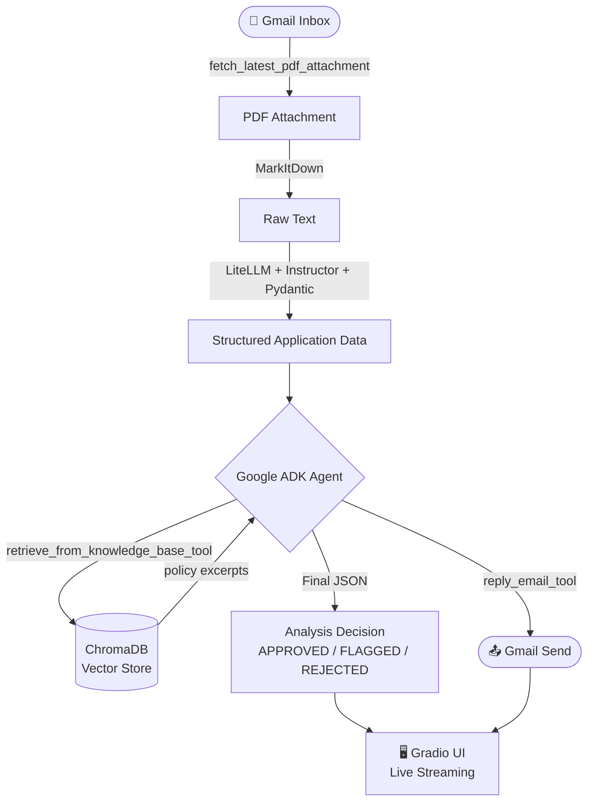

# 🏢 Lease Application Analyzer

> ⚠️ **Toy Project Notice**
> This is a personal learning project. All data (applicant names, addresses, income figures, pet details) is entirely synthetic and generated using LLM models. All company names, policies, and unit identifiers are imaginary and used purely for practice. The core logic, architecture, and wiring were designed and implemented from scratch; AI coding assistance was used subsequently to enhance, refine, and extend the solution.

---

## Overview

An end-to-end agentic pipeline that:

1. **Fetches** an incoming lease application PDF from Gmail
2. **Extracts** structured applicant data using an LLM with a Pydantic schema
3. **Evaluates** the application against company policy via a Google ADK agent with RAG (ChromaDB vector search)
4. **Replies** to the applicant by email with a politely composed outcome letter
5. **Displays** every step live in a Gradio web UI

---

## Business Use Case

**Apex Property Management** receives residential lease applications as PDF attachments via email. Each application contains applicant details (income, pets, requested unit), but reviewing them manually against building rules and underwriting policies is slow and error-prone.

This system automates that workflow:

- A prospective tenant emails their completed lease application as a PDF.
- The agent extracts key fields (name, unit, monthly income, pet details) and cross-references them against three internal policy documents: building eligibility rules, pet and occupancy limits, and credit underwriting thresholds.
- Based on the evaluation it reaches one of three outcomes:
  - **APPROVED** — all checks pass; applicant receives a confirmation email.
  - **FLAGGED** — something is ambiguous or unconfirmed (e.g. income not verified); applicant is asked to follow up, and the case is held for human review.
  - **REJECTED** — a hard policy violation (e.g. pet exceeds weight limit, income critically below threshold); applicant receives a polite rejection.

The three synthetic test scenarios cover a clean approval, a pet policy violation, and a malformed/incomplete application.

---

## Architecture & Flow



### Request lifecycle inside the agent

```
Agent receives structured application JSON
    │
    ├─► retrieve_from_knowledge_base_tool("income ratio requirement <unit>")
    │       └─ SentenceTransformer embed → ChromaDB cosine search → policy text
    │
    ├─► retrieve_from_knowledge_base_tool("pet policy <unit>")   [if needed]
    │
    ├─► reply_email_tool(composed email)
    │       └─ Gmail API send → reply in original thread
    │
    └─► Final response: compliance JSON
            { decision, income_check, pet_check, completeness_check, reasons, notes }
```

---

## Tech Stack

| Layer | Library / Tool |
|---|---|
| Agent framework | [Google ADK](https://github.com/google/adk-python) `>= 2.2.0` |
| LLM interface | [LiteLLM](https://github.com/BerriAI/litellm) `>= 1.88.1` |
| Structured extraction | [Instructor](https://github.com/jxnl/instructor) `>= 1.15.1` |
| PDF text extraction | [MarkItDown](https://github.com/microsoft/markitdown) `>= 0.1.6` |
| Vector store | [ChromaDB](https://www.trychroma.com/) `>= 1.5.9` |
| Embeddings | [sentence-transformers](https://www.sbert.net/) `>= 5.5.1` |
| Email (fetch + send) | Gmail API via `google-api-python-client` |
| Web UI | [Gradio](https://www.gradio.app/) `>= 6.18.0` |
| Dependency management | [uv](https://github.com/astral-sh/uv) |
| Python | `>= 3.11` |

### Tested models

| Model | Role | Notes |
|---|---|---|
| `ministral-3:8b-cloud` (via Ollama) | Structured extraction + agent reasoning | Main tested model. Occasionally ignores strict JSON-only output instructions — prompt hardening and regex fallback applied. |

The LiteLLM integration means any OpenAI-compatible endpoint works (swap `LLM_MODEL` and `BASE_URL` in `.env`).

---

## Project Structure

```
lease_application_proj/
├── app.py                           # Gradio UI entry point
├── pyproject.toml
├── .env.example                     # Copy to .env and fill in values
├── secrets/
│   ├── credentials.json             # Gmail OAuth client credentials
│   └── token.json                   # Auto-generated after first auth
├── src/
│   ├── solution_pipeline.py         # Top-level orchestration (CLI entry)
│   ├── agent_execution.py           # Google ADK runner (sync + async streaming)
│   ├── agent_tools.py               # Tool definitions with ToolContext
│   ├── analysis_agent.py            # LlmAgent factory
│   ├── email_handler.py             # Gmail fetch + send
│   ├── extract_pdf_data.py          # MarkItDown PDF → text
│   ├── get_structured_output.py     # LLM → Pydantic LeaseApplication
│   ├── schemas.py                   # Pydantic models
│   └── prompts/
│       └── analysis_agent_instruction_prompt.md
├── vector_db_operations/
│   ├── create_collections.py        # Ingest .md / .pdf → ChromaDB
│   └── retriever.py                 # Query ChromaDB (ADK tool backend)
├── synthetic_data/
│   ├── generate_synthetic_data.py   # Generate mock PDFs + knowledge base
│   ├── knowledge_base/              # Policy .md files (ingested into ChromaDB)
│   └── mock_inputs/                 # Generated test PDFs
└── local_vdb/
    └── chroma_db/                   # ChromaDB persistence directory
```

---

## Setup

### Prerequisites

- Python 3.11+
- [uv](https://github.com/astral-sh/uv) installed (`pip install uv` or see uv docs)
- An LLM served at an OpenAI-compatible endpoint (e.g. [Ollama](https://ollama.com/))
- A Google Cloud project with the **Gmail API** enabled and OAuth 2.0 credentials downloaded

---

### Step 1 — Clone and install dependencies

```bash
git clone <repo-url>
cd lease_application_proj
uv sync
```

---

### Step 2 — Configure environment variables

```bash
cp .env.example .env
```

Open `.env` and update the following:

| Variable | What to change |
|---|---|
| `LLM_MODEL` | Model name as expected by LiteLLM (e.g. `ministral-3:8b-cloud`) |
| `BASE_URL` | Base URL of your OpenAI-compatible LLM server (e.g. `http://localhost:11434/v1`) |
| `OPENAI_API_KEY` | API key if your endpoint requires one; set to any non-empty string for Ollama |
| `EMBEDDING_MODEL` | HuggingFace model ID for embeddings (default: `sentence-transformers/all-MiniLM-L6-v2`) |
| `COLLECTION` | ChromaDB collection name (default: `lease_docs`) |
| `LOCAL_VDB_PATH` | Path where ChromaDB persists data (default: `local_vdb/chroma_db`) |
| `N_RESULTS` | Number of chunks to retrieve per query (default: `3`) |
| `KNOWLEDGE_BASE_DOCS_DIR` | Path to knowledge base documents (default: `synthetic_data/knowledge_base`) |
| `GMAIL_CREDENTIALS_FILE` | Path to your Gmail OAuth credentials JSON (default: `secrets/credentials.json`) |
| `GMAIL_TOKEN_FILE` | Path where the OAuth token is saved after first login (default: `secrets/token.json`) |

---

### Step 3 — Set up Gmail credentials

1. Go to [Google Cloud Console](https://console.cloud.google.com/) → **APIs & Services** → **Library**
2. Enable the **Gmail API**
3. Go to **Credentials** → **Create Credentials** → **OAuth 2.0 Client ID** (Desktop app)
4. Download the JSON file and save it to `secrets/credentials.json`
5. On the **OAuth consent screen**, add your Gmail address as a test user

The OAuth browser flow runs automatically on the first execution and saves a token to `secrets/token.json` for subsequent runs.

---

### Step 4 — Generate synthetic test data

This creates the mock PDF applications (`perfect_app.pdf`, `pet_violation.pdf`, `malformed.pdf`) and the knowledge base `.md` files used in development.

```bash
uv run synthetic_data/generate_synthetic_data.py
```

Generated files:
- `synthetic_data/mock_inputs/*.pdf` — test lease application PDFs
- `synthetic_data/knowledge_base/*.md` — policy documents (already committed)

---

### Step 5 — Build the vector database

Ingest all knowledge base documents into ChromaDB. This reads every `.md` (and optionally `.pdf`) file from `KNOWLEDGE_BASE_DOCS_DIR`, chunks them by section heading, embeds them with the configured SentenceTransformer model, and stores them in ChromaDB.

```bash
uv run vector_db_operations/create_collections.py
```

This is **idempotent** — re-running replaces existing document chunks so it is safe to run after updating policy files.

Expected output:
```
Collection 'lease_docs' ready — existing chunk count: 0
Loading documents from: synthetic_data/knowledge_base
  Loaded 'building_rules_and_eligibility.md': 3 chunk(s)
  Loaded 'credit_underwriting_protocols.md': 3 chunk(s)
  Loaded 'unit_availability_ledger.md': 3 chunk(s)
Total chunks in collection after ingestion: 9
── Sanity queries ───────────────────────────────────
Query : 'pet weight limit Apt 402'
  doc : building_rules_and_eligibility.md  chunk 0  dist=0.2829 ...
```

---

### Step 6 — Run the Gradio UI

```bash
uv run app.py
```

Open **http://127.0.0.1:7860** in your browser.

Click **📧 Fetch & Analyze Latest Email** to trigger the full pipeline. All steps stream live into the page as they complete:

| Section | When it appears |
|---|---|
| 📨 Email Source | Immediately after email is fetched |
| 📋 Extracted Application Data | After PDF is parsed and structured |
| 🔍 Agent Tool Calls | As each tool call fires (with query and status) |
| 📚 Retrieved Policy Documents | As each tool result returns |
| ⚖️ Analysis Decision | After the agent produces the final JSON |

> **Note — emails are not marked as read automatically.**
> This is intentional. The pipeline always targets the **latest unread email with a PDF attachment**. If you want to process the older emails, manually open and mark the latest emails as read in Gmail first — otherwise every run will re-analyse the 'latest unread email which has a pdf attachment'.

---

### Step 7 (optional) — Run the CLI pipeline

For headless / scripted use without the UI:

```bash
uv run src/solution_pipeline.py
```

This fetches the latest unread Gmail attachment, runs the full pipeline, prints the structured data and analysis result to the terminal, and sends the reply email.

---

## Knowledge Base Documents

The three policy documents in `synthetic_data/knowledge_base/` define the eligibility rules the agent retrieves at runtime:

| File | Contents |
|---|---|
| `building_rules_and_eligibility.md` | Income-to-rent ratios and pet weight limits by unit type (Apt 400-499, Townhouse Suite A-Z, Premium Studios 100-150) |
| `credit_underwriting_protocols.md` | Credit score tiers (Prime ≥700, Conditional 620-699, High-Risk <620) and co-signer requirements |
| `unit_availability_ledger.md` | Per-unit availability status, base rent, and move-in dates |

To update policies, edit the `.md` files and re-run `create_collections.py`.

---

## Test Applications

Three synthetic PDFs are generated for local testing:

| File | Scenario | Expected decision |
|---|---|---|
| `perfect_app.pdf` | All fields complete, income confirmed, no pets, unit available | APPROVED |
| `pet_violation.pdf` | Dog (82 lbs) applying for Apt 402 (25 lb limit) | REJECTED |
| `malformed.pdf` | Missing income, illegible name, vague unit ID | FLAGGED |

To test with a specific file without using Gmail, temporarily point `pdf_file` in `solution_pipeline.py`'s `__main__` block to the desired path.

---

## Notes & Known Limitations

- **Small model compliance**: `ministral-3:8b-cloud` occasionally outputs reasoning prose instead of the required JSON. A two-stage fallback is applied: markdown fence stripping → regex `{...}` extraction → raw text display.
- **Dummy retriever removed**: early development used hardcoded dummy chunks. The live ChromaDB retriever is now active; `create_collections.py` must be run before the agent can retrieve policy.
- **Gmail OAuth**: the first run opens a browser for OAuth consent. Subsequent runs are silent as long as `token.json` is valid.
- **Embedding model cold start**: the SentenceTransformer model is loaded once per process (lazy singleton) and cached for all subsequent tool calls.
- **Session state**: email metadata (sender, subject, thread ID) is stored in the ADK session state so `reply_email_tool` can reply in the correct thread without needing it passed as a parameter.
